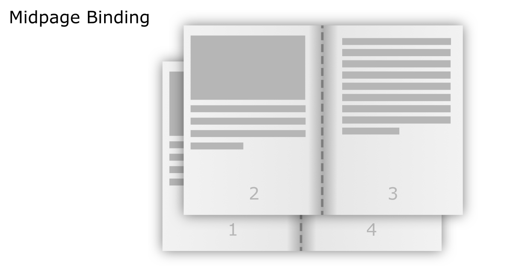
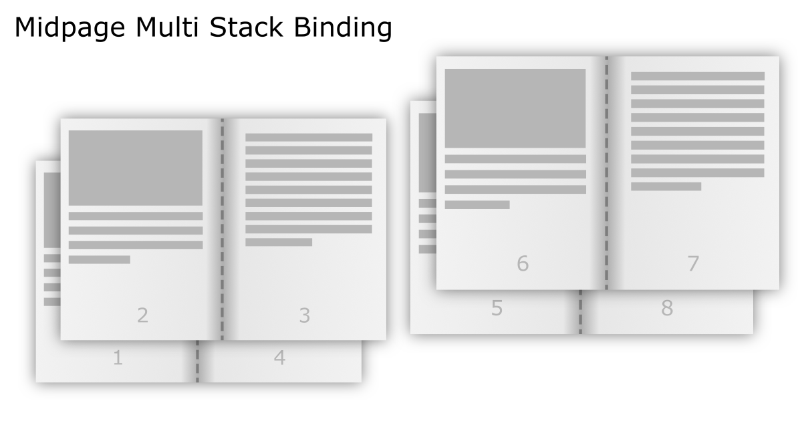
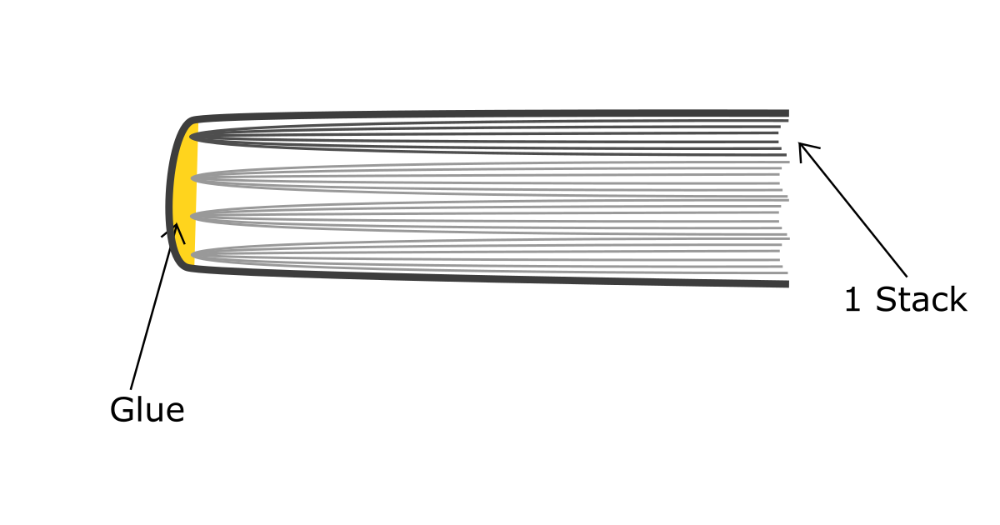

# Homepress

Converts your documents of a multitude of types into several different formats
including pdfs. A swiss army knife of printing documents. From creating small booklets
to printing large books, and a lot of other goodies!

# Features

* Supports a multitude of input formats such as `icb dib jp2 hdf qoi epub fli wmf mpeg iim im gif jpf dds pbm xps blp svg png tiff pdf ftu msp pcd psd jpe cbr pxr ftc fits ppm sgi xpm j2k pcx vst icns ras grib pfm rgb fit jpc h5 vda eps jpx fb2 mobi rgba cbz cur dcx mpg tga pgm xbm txt gbr j2c tif pnm jfif webp ps bw emf jpg jpeg flc apng bmp bufr ico`
* Print small booklets with *Midpage Binding Algorithm*
* Print large booklets with *Mult Stack Midpage Binding Algorithm*
* Render input documents as *images*
* Render input documents as images and store them as a *pdf file (merge)*
* Allows you to *extract text* from supported documents

# The `Press`

Homepress comes with a press object that takes in input files and outputs them as pdf
files / images / text. This press object takes in what we call `Renderer`, and
these renderers provide methods to render / generate images from input files. All the
Image formats are derived from PIL (Pillow). To get a list of available input formats
at runtime, run `homepress --formats`

```
usage: homepress press [-h] [-i INPUT] [--ignore-errors] [-p PAGES]
                       press_commands ...

positional arguments:
  press_commands
    midpage             middle page binded books are a stack of sheets ordered
                        in a way that when folded from the middle and binded
                        there produce a perfectly ordered book
    midpage-multi       similar to midpage binding, except, the input is split
                        into several stacks (suitable for binding large
                        documents)
    merge               renders and merges the input file to a pdf document
    images              renders and outputs the image files into a folder
                        consisting of the images specified by format
    text                extracts all the text from inputs supporting it and
                        saves it to a text file

options:
  -h, --help            show this help message and exit
  -i INPUT, --input INPUT
                        add multiple input files by repeating this parameter,
                        may also be a folder containing files, run `homepress
                        --help` for a list of supported input file formats
  --ignore-errors       ignores errors if any while reading the input files
  -p PAGES, --pages PAGES
                        page range to take from the input, is a comma
                        separated list defining page ranges example:
                        1,4,6-10,12 by default takes all the pages
```

Here's a short brief on all the `Press` methods.

## Midpage Binding



Here the input pages are printed on the half of the whole page and the printed stack is
folded from the middle and binded there. This works for a stack at most 10-20 pages thick.
Binding is done manually using stapler or thread.

Command for this becomes:

```
homepress press -i <input_file> [-i <input_file>...] midpage [printing_options...] <output_file>
```

The list of all options is as follows

```
usage: homepress press midpage [-h] [-s SIZE] [-m MARGIN] [-p PPI] [-r] [-f]
                               output

positional arguments:
  output                path to output pdf file

options:
  -h, --help            show this help message and exit
  -s SIZE, --size SIZE  output document page size, defaults to 'A4', valid
                        values can be A4, Letter, Legal, Ledger or a comma
                        separated value defining 'w/h_ratio,width_in_inches'
  -m MARGIN, --margin MARGIN
                        page margins defined by comma separated values in the
                        format top,[outer,[bottom,[inner]]] where values
                        within square brackets may be omitted. defaults to 0
  -p PPI, --ppi PPI     pixel density defined as pixels per inch, defaults to
                        200
  -r, --rtl             output media's page direction is set to right to left
                        with this option
  -f, --flip-even       flip even pages horizontally by rotating them 180
                        degrees
```

## Multi Stack Midpage Binding



It is similar to midpage binding. The difference being that the input files are
split into stacks of input pages. Then, midpage binding is performed on these
stacks individually.

The multiple stacks that are produced can be binded together via special threading
techniques or glue like shown below.

In case the `--separate-stacks` flag is provided, the output path must be a folder
(which is automatically created if it doesn't exist).



Command for this becomes:

```
homepress press -i <input_file> [-i <input_file>...] midpage-multi [printing_options...] <output_file/output_folder>
```

The list of all options is as follows

```
usage: homepress press midpage-multi [-h] [-s SIZE] [-m MARGIN] [-p PPI] [-r]
                                     [-f] [--separate-stacks]
                                     [-sp STACK_PREFIX] [-ss STACK_SIZE]
                                     output

positional arguments:
  output                path to output pdf file or a path to folder containing
                        individual stack files if --separate_stacks is passed

options:
  -h, --help            show this help message and exit
  -s SIZE, --size SIZE  output document page size, defaults to 'A4', valid
                        values can be A4, Letter, Legal, Ledger or a comma
                        separated value defining 'w/h_ratio,width_in_inches'
  -m MARGIN, --margin MARGIN
                        page margins defined by comma separated values in the
                        format top,[outer,[bottom,[inner]]] where values
                        within square brackets may be omitted. defaults to 0
  -p PPI, --ppi PPI     pixel density defined as pixels per inch, defaults to
                        200
  -r, --rtl             output media's page direction is set to right to left
                        with this option
  -f, --flip-even       flip even pages horizontally by rotating them 180
                        degrees
  --separate-stacks     separate the stacks of the said document into separate
                        pdf files stored in the `output` folder
  -sp STACK_PREFIX, --stack-prefix STACK_PREFIX
                        use the said stack_prefix for the file names, by
                        default `stack_`, this is followed by stack number
  -ss STACK_SIZE, --stack-size STACK_SIZE
                        number of pages per stack, this may be increased by 1
                        to eliminate an ending smaller stack, defaults to 40
```

## Images

Takes the given input files and renders then into images. The maximum resolution
on the either of the axes is provided by `--resolution`. The output folder is created
if it doesn't exist. This method supports output in all the formats
supported by PIL (Pillow).

Command for this becomes:

```
homepress press -i <input_file> [-i <input_file>...] images [render_options] <output_folder>
```

List of all options is as follows

```
usage: homepress press images [-h] [-r RESOLUTION] [-f FILE_PREFIX]
                              [-fmt FORMAT] [-p KEY=VALUE]
                              output

positional arguments:
  output                path to output folder

options:
  -h, --help            show this help message and exit
  -r RESOLUTION, --resolution RESOLUTION
                        resolution is a comma separated value
                        resolution_x,resolution_y defining maximum resolution
                        in pixels for their respective axis, defaults to 1600
                        in both directitons
  -f FILE_PREFIX, --file-prefix FILE_PREFIX
                        file name prefix for the image files. defaults to
                        nothing
  -fmt FORMAT, --format FORMAT
                        image file format to use to save the image, 'png' is
                        stored using pymupdf, other file formats are stored
                        using PIL (Pillow), defaults to png
  -p KEY=VALUE, --pil KEY=VALUE
                        options to pass to pil saver, formatted as key=value,
                        value is autoconverted to integer or float if the
                        value is parsable as such
```

## Merge

Similar to Images, it renders all the input files with the given `--resolution`
(See [Images](#images) for more information on resolution). The rendered images
are then merged into a single pdf document

Command for this becomes:

```
homepress press -i <input_file> [-i <input_file>...] merge [render_options] <output_file>
```

List of all options is as follows

```
usage: homepress press merge [-h] [-r RESOLUTION] output

positional arguments:
  output                path to output pdf file

options:
  -h, --help            show this help message and exit
  -r RESOLUTION, --resolution RESOLUTION
                        resolution is a comma separated value
                        resolution_x,resolution_y defining maximum resolution
                        in pixels for their respective axis, defaults to 1600
                        in both directitons
```

## Text

Extracts text from input_file formats that support text, saves the text data
to the given output file. The individual pages are separated by a blank line in
the output text file.

Command for this becomes:

```
homepress press -i <input_file> [-i <input_file>...] text [text_options] <output_file>
```

List of all options is as follows

```
usage: homepress press text [-h] output

positional arguments:
  output      path to a text file to store the text output

options:
  -h, --help  show this help message and exit
```
